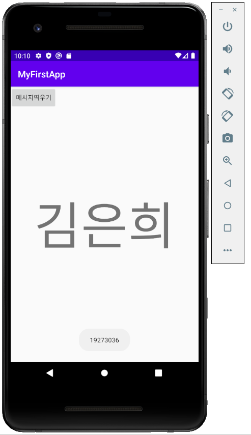
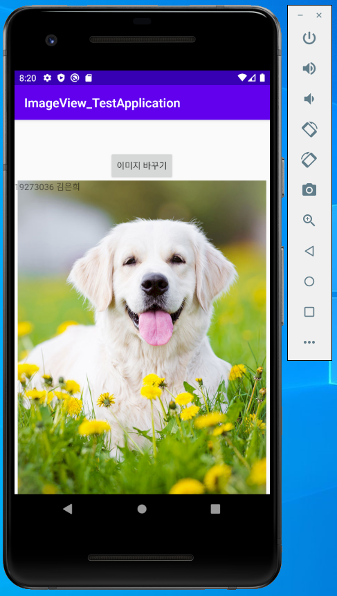
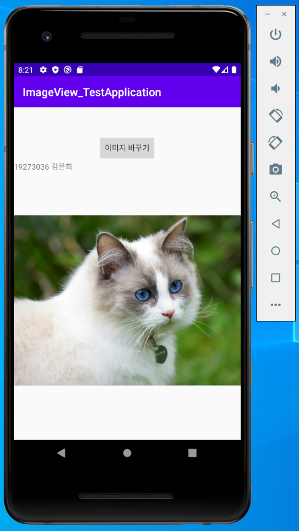

# 19273036 김은희

## 1주차 과제 

## 2주차 과제
</img>

## 3주차 과제
</img>
</img>

## 4주차 과제 
- 제품 브랜드에 대해서 자세하게 알려주는 앱 

의류, 잡화, 가전제품, 기타제품 등. 

구매한 제품에 대해서 잘 모르거나, 제품의 브랜드가 궁금할 때 사진으로 찍거나 동영상을 촬영.

제품의 브랜드에 대한 소개와 정보를 알려준다. 

제품을 구매하기를 원하면 온라인 사이트를 연결해주거나, 오프라인 매장에 대한 정보를 준다. 

오프라인 매장에 대한 정보 - 여러 오프라인 매장 위치를 알려주고, 각 매장에 제품이 얼마나 남았는가 와 어디에 있는지 제품의 위치를 알려준다. 

## 7주차 과제
</img>
</img>

## 9주차 과제
</img>
</img>
</img>
</img>
</img>
</img>

## 10주차 과제
</img>
</img>
</img>
</img>
</img>

## 11주차 과제 
</img>
</img>
</img>
</img>
